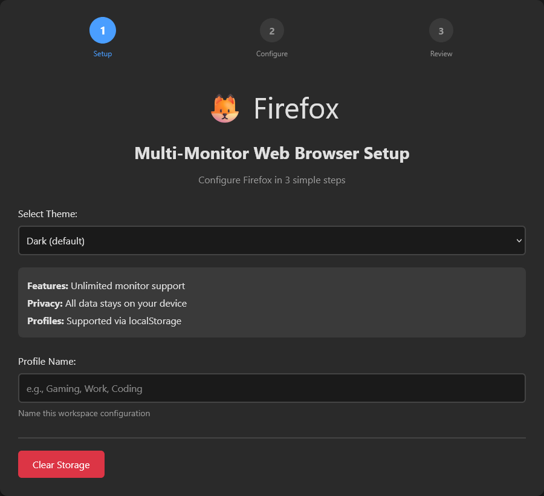
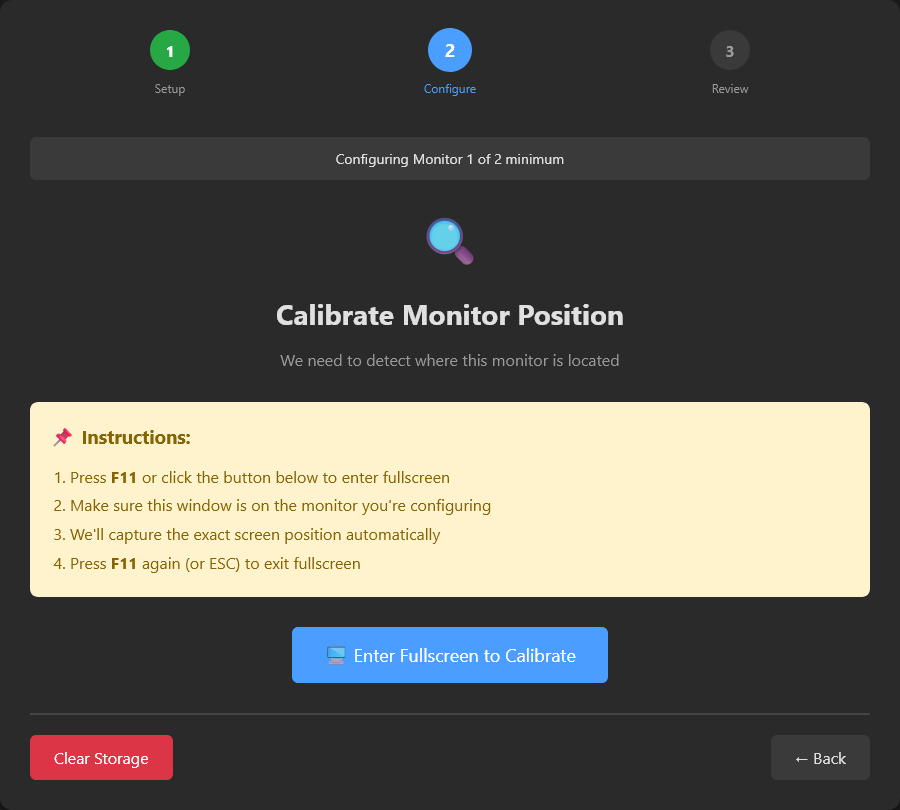
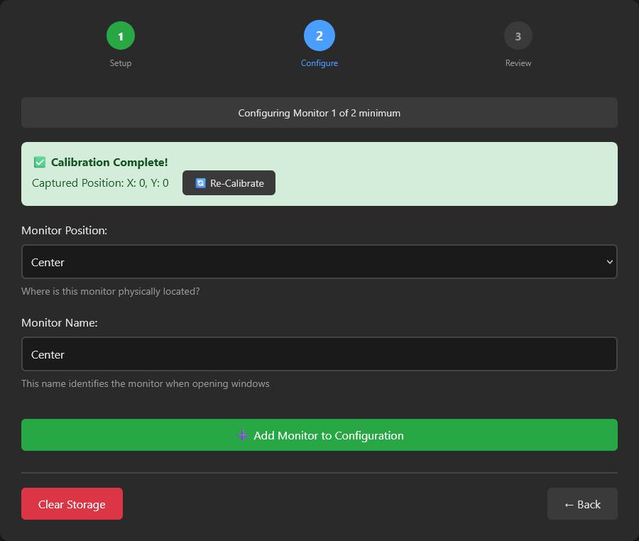
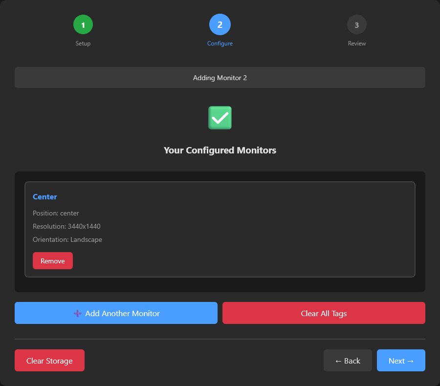
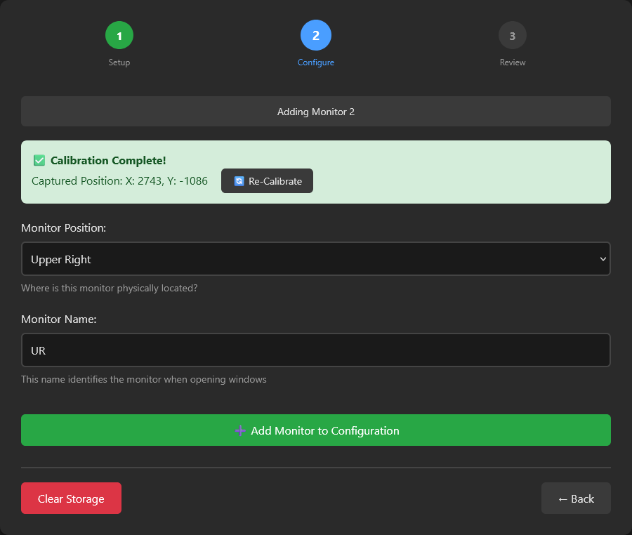
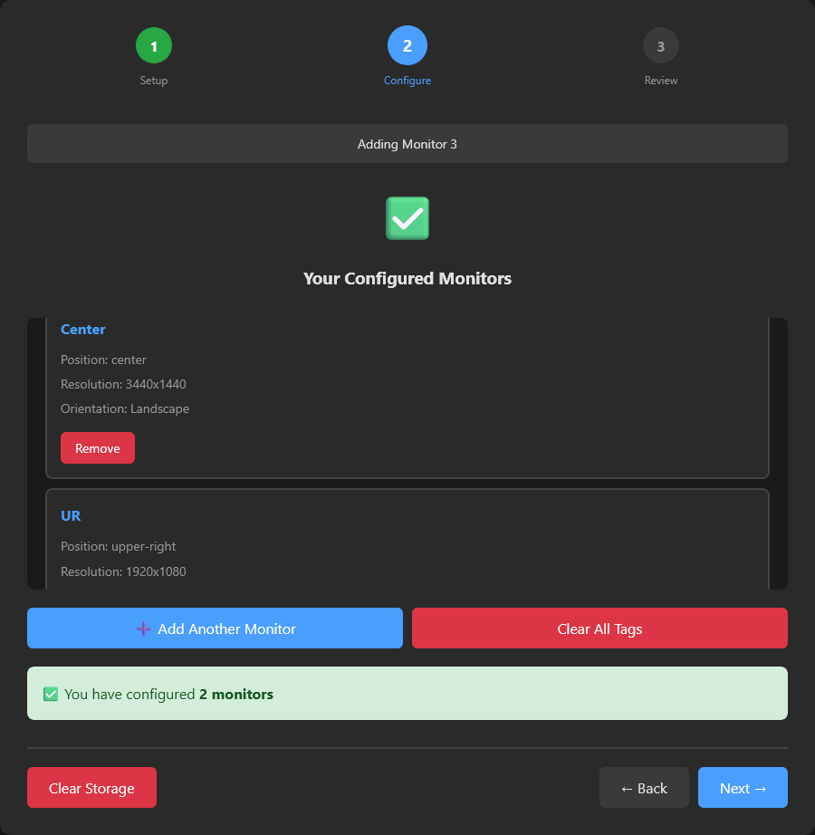
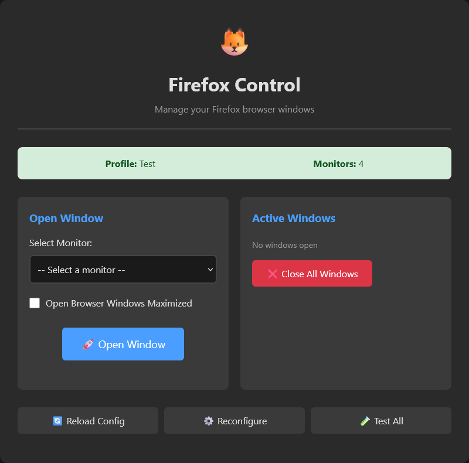
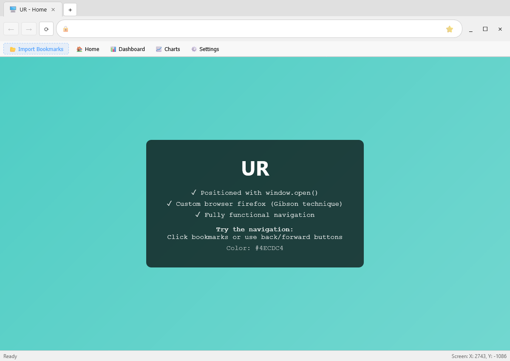

# Firefox-Multi-Monitor-Web-Browser-Wizard-Setup
A 3 Step Wizard to allow Firefox to be opened on multiple monitors

Hopefully Firefox or a browser built with the Gecko Engine will fine this demo useful

Included 10 screenshots for reference.

